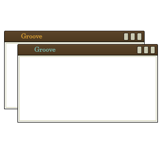

# kde-theme-groove
A kwin/aurora (vector) version of the pixel based on "Groove" originally designed by Heylove and Senex (2005) via Urukrama.


If you are installing this window decoration without the kde tools, they seem be installed for kwin in:
```
~/.local/share/aurorae/themes/Groove/
```
